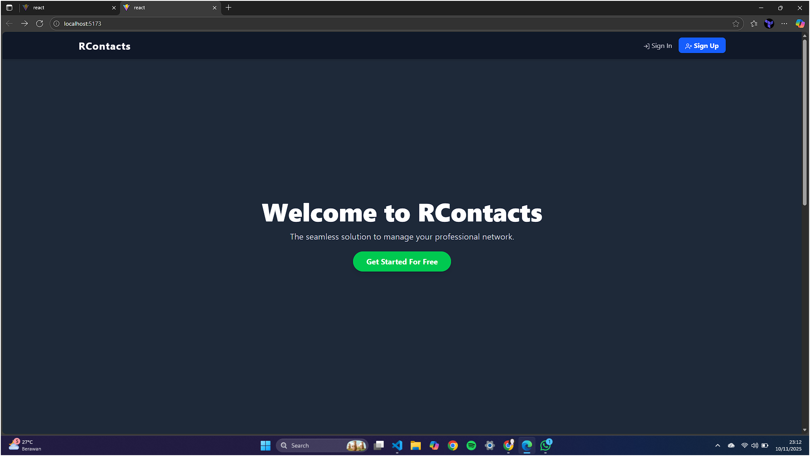

# R-Contacts Client

This project is the client-side implementation of the R-Contacts application. It is designed to be implemented using various frontend frameworks to showcase their differences and capabilities.

<div align="center">
  
  
  
</div>

## Implementations

This repository will contain the following implementations:

-   [React Implementation](#react-implementation)
-   [Vue Implementation](#vue-implementation)
-   [Svelte Implementation](#svelte-implementation)

---

## React Implementation

This is the first implementation of the R-Contacts client, built with React and Vite.

### Supporting Libraries
<div>
  
  
  
  
</div>

### Screenshot



### Getting Started

1.  Navigate to the `react` directory:
    ```bash
    cd react
    ```
2.  Install the dependencies:
    ```bash
    npm install
    ```
3.  Start the development server:
    ```bash
    npm run dev
    ```

---

## Vue Implementation

> Coming Soon!

---

## Svelte Implementation

> Coming Soon!